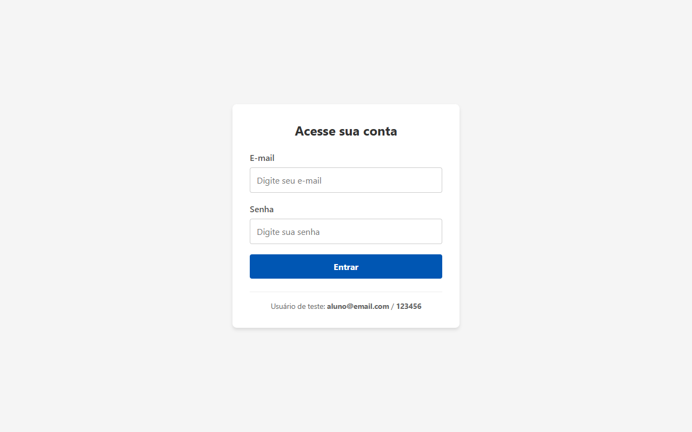
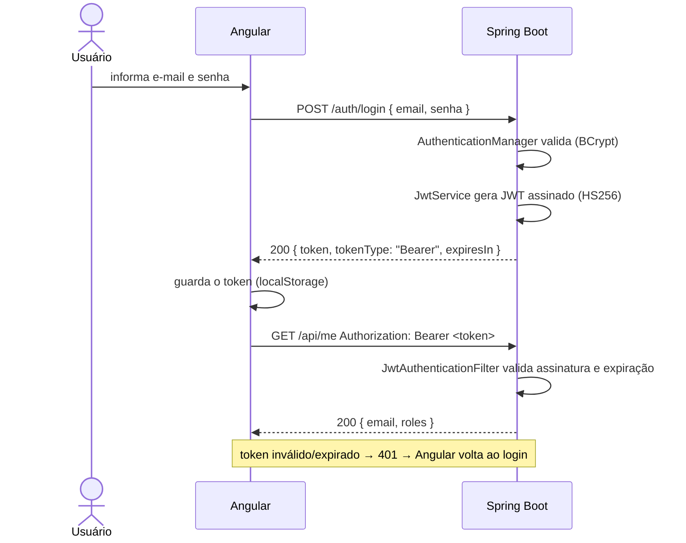
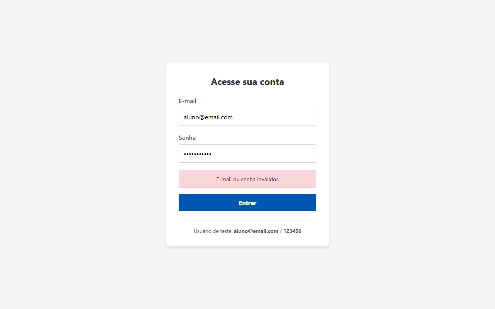
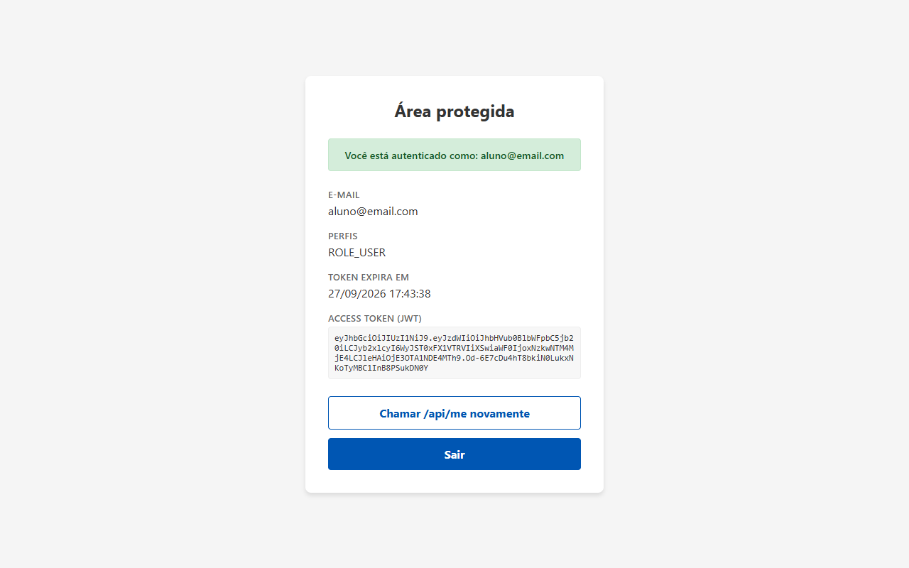

# Autenticação com JWT — Spring Boot + Angular

Tela de login com autenticação no servidor usando **JSON Web Token (JWT)**.

A senha é usada **somente no login**. Depois disso, todas as requisições
protegidas usam apenas o **Access Token** — a senha nunca é reenviada.



## Fluxo



## Tecnologias

| Camada   | Tecnologias |
|----------|-------------|
| Backend  | Java 17+, Spring Boot 4.1, Spring Security 7, JJWT 0.13, Bean Validation |
| Frontend | Angular 22 (standalone, signals), Reactive Forms, HttpClient com interceptor funcional, Router com guards |
| Testes   | JUnit 5 + MockMvc (backend), Vitest (frontend) |

## Como executar

### Pré-requisitos
- **Java 17+** (testado com Java 21)
- **Node.js 22.22.3+ ou 24.15+** (exigência do Angular CLI 22)
- Porta **8080** livre (XAMPP/Apache costumam usá-la — pare o serviço antes)

### 1. Backend (porta 8080)

```bash
cd backend
./mvnw spring-boot:run        # Windows: mvnw.cmd spring-boot:run
```

### 2. Frontend (porta 4200)

```bash
cd frontend/app-autenticacao
npm install
npm start
```

Acesse **http://localhost:4200** e entre com o usuário de teste:

| E-mail            | Senha    |
|-------------------|----------|
| `aluno@email.com` | `123456` |

## Endpoints da API

| Método | Rota          | Protegida | Descrição |
|--------|---------------|-----------|-----------|
| GET    | `/`           | não       | Health check (“Backend funcionando!”) |
| POST   | `/auth/login` | não       | Recebe `{ email, senha }` e devolve o JWT |
| GET    | `/api/me`     | **sim**   | Dados do usuário dono do token |

### Exemplos com curl

```bash
# Login → 200 com o token
curl -X POST http://localhost:8080/auth/login \
  -H "Content-Type: application/json" \
  -d '{"email":"aluno@email.com","senha":"123456"}'
# {"token":"eyJhbGciOiJIUzI1NiJ9...","tokenType":"Bearer","expiresIn":3600}

# Rota protegida com o token → 200
curl http://localhost:8080/api/me -H "Authorization: Bearer <token>"
# {"email":"aluno@email.com","roles":["ROLE_USER"],"mensagem":"Você está autenticado como: aluno@email.com"}
```

### Respostas de erro

| Situação                               | Status | Corpo |
|----------------------------------------|--------|-------|
| E-mail ou senha errados                | 401    | `{"status":401,"erro":"E-mail ou senha inválidos"}` |
| Campos vazios / e-mail malformado      | 400    | `{"status":400,"erro":"E-mail inválido"}` |
| Rota protegida sem token, token adulterado ou expirado | 401 | `{"status":401,"erro":"Token ausente, inválido ou expirado"}` |

## Estrutura

```
backend/src/main/java/com/exemplo/authapi
├── config/
│   ├── SecurityConfig.java          # regras de acesso, stateless, BCrypt, 401 em JSON
│   ├── JwtAuthenticationFilter.java # lê "Authorization: Bearer" e autentica a requisição
│   └── CorsConfig.java              # libera o Angular (localhost:4200)
├── controller/
│   ├── AuthController.java          # POST /auth/login
│   ├── UsuarioController.java       # GET /api/me (protegida)
│   └── TesteController.java         # GET /
├── service/JwtService.java          # gera e valida o JWT
├── exception/GlobalExceptionHandler.java
└── dto/                             # LoginRequest, LoginResponse, ErroResponse

frontend/app-autenticacao/src/app
├── login/                 # tela de login
├── home/                  # área protegida (chama /api/me)
├── services/
│   ├── auth.service.ts      # login, token, expiração, logout
│   └── auth.interceptor.ts  # anexa o Bearer e trata 401
└── guards/auth.guard.ts   # bloqueia /home sem token válido
```

## Segurança

- Senha armazenada com **BCrypt** e trafegada apenas no `POST /auth/login`.
- Token assinado com **HMAC-SHA256**; qualquer alteração invalida a assinatura.
- Expiração de **1 hora** (`jwt.expiration-ms`).
- API **stateless**: nenhuma sessão no servidor; cada requisição traz seu token.
- A chave secreta pode ser trocada pela variável de ambiente `JWT_SECRET`
  (mínimo 32 caracteres) sem alterar código.
- O token vai apenas para o backend configurado — o interceptor não o envia a outros domínios.

## Testes

```bash
# Backend: 14 testes (login, 401/400, token válido, adulterado e expirado)
cd backend && ./mvnw test

# Frontend: 14 testes (login, interceptor, guards, serviço)
cd frontend/app-autenticacao && npx ng test --watch=false
```

## Telas

| Login com erro | Área protegida |
|---|---|
|  |  |

## Apresentação

Slides da apresentação (conceito + solução): [`docs/apresentacao-jwt.pptx`](docs/apresentacao-jwt.pptx)
